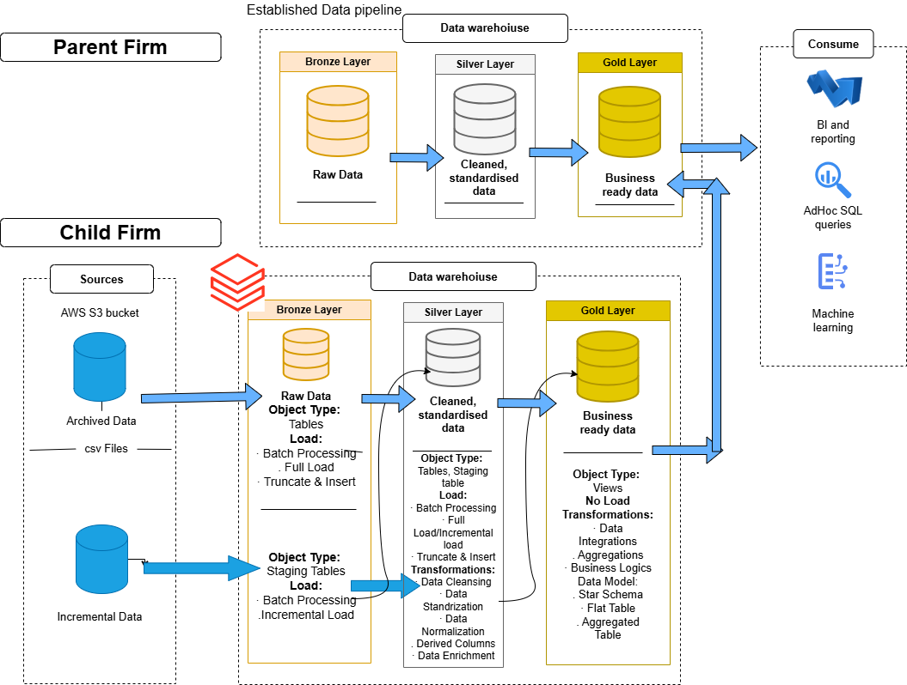

# Sports Equipment & Nutrition Data Platform (Databricks Medallion Architecture)

## 📌 Project Overview

This project simulates a **real-world data engineering use case** where a **sports equipment reseller (Parent Company)** acquires a **sports nutrition company (Child Company)**.

The parent company already operates on a **mature, streamlined data pipeline**, while the child company has **large volumes of historical and incremental data stored as CSV files in AWS S3**.

The goal of this project is to:
- Ingest raw CSV data from AWS S3
- Build a **scalable, structured data pipeline using Medallion Architecture**
- Standardize and integrate the child company’s data
- Align it with the parent company’s existing analytics-ready data model
- Enable **BI, Ad-hoc analytics, and Machine Learning use cases**

This project is built using **Databricks** and focuses on **batch processing, data quality, and analytics readiness**.

---

## 🏗️ Architecture Overview

The pipeline follows the **Medallion Architecture (Bronze → Silver → Gold)** pattern.

### High-level Flow:
1. **AWS S3** stores archived and incremental CSV files from the child company
2. Data is ingested into **Databricks Bronze Layer**
3. Cleaned and standardized in the **Silver Layer**
4. Transformed into **business-ready analytical models in the Gold Layer**
5. Gold data is consumed by:
   - BI & Reporting tools
   - Ad-hoc SQL queries
   - Machine Learning workflows

---

## 🧱 Medallion Layers Explained

### 🥉 Bronze Layer – Raw Ingestion
**Purpose:** Preserve raw data with minimal transformation  

- Source: AWS S3 (CSV files)
- Object Types:
  - Raw Tables
  - Staging Tables
- Load Types:
  - Full Load (Archived Data)
  - Incremental Load (New Data)
- Processing:
  - Batch processing
- Design Principle:
  - Schema-on-read
  - No business logic applied

---

### 🥈 Silver Layer – Cleaned & Standardized Data
**Purpose:** Improve data quality and prepare for analytics  

- Object Types:
  - Cleaned Tables
  - Staging Tables
- Load Types:
  - Full Load
  - Incremental Load
- Transformations:
  - Data cleansing (null handling, duplicates)
  - Data standardization
  - Data normalization
  - Derived columns
  - Data enrichment
- Design Principle:
  - Conformed dimensions
  - Analytics-friendly schemas

---

### 🥇 Gold Layer – Business Ready Data
**Purpose:** Enable reporting, analytics, and ML  

- Object Types:
  - Views (no physical load)
- Transformations:
  - Data integration across domains
  - Aggregations
  - Business logic
- Data Models:
  - Star Schema
  - Flat Tables
  - Aggregated Tables
- Consumption:
  - BI dashboards
  - Ad-hoc SQL queries
  - Machine learning pipelines

---

## 🔄 Parent vs Child Company Integration

- **Parent Company**
  - Already has an established and optimized data pipeline
  - Operates on curated, business-ready datasets

- **Child Company**
  - Legacy CSV-based data stored in AWS S3
  - No standardized schema or pipeline
  - This project focuses on:
    - Modernizing the child company’s data
    - Bringing it in sync with the parent company’s data standards

The final **Gold Layer aligns both companies' data models**, enabling cross-company analytics.

---

## 🛠️ Tech Stack

- **Cloud Storage:** AWS S3  
- **Data Platform:** Databricks  
- **Processing Engine:** Apache Spark (PySpark)  
- **Architecture Pattern:** Medallion Architecture  
- **Data Formats:** CSV, Delta Tables  
- **Orchestration:** Databricks Workflows (conceptual)  
- **Analytics:** SQL, BI-ready datasets, Databricks dashboard  
